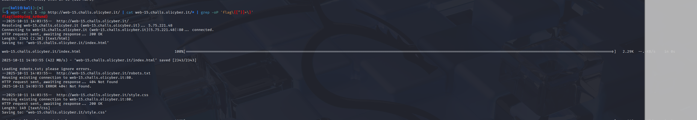

Web 15 - Web Technologies: External Resources

wget -r -l 1 -np http://web-15.challs.olicyber.it/ | cat web-15.challs.olicyber.it/* | grep -oP 'flag\{[^}]+\}'

I use wget cat and grep to get the files associated with that url 

It automatically uses grep to find the flag 

## Note ## 

we are also provided the web server code in challenge.py. We can see that the challenge is written in flask and spins up a web page with 1, 10000000 pages and places the flag in one
